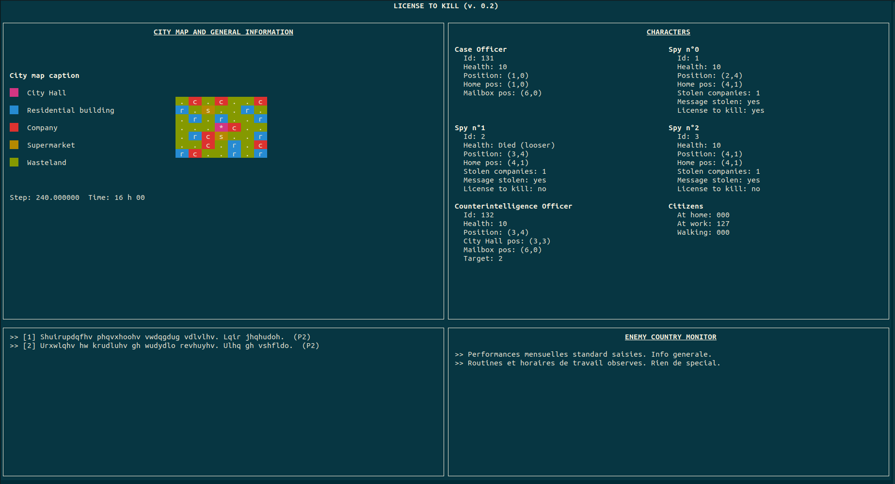

# Resources for the "License to kill" project 

## Monitor program

The *ncurses* TUI (*Terminal User Interface*) will give better results using 
The "Meslo LG L for Powerline" font that should already be installed on your
system. The font can also be downloaded at [https://github.com/powerline/fonts](https://github.com/powerline/fonts).

Here is what you should see by running "`bin/monitor`" from the root of your 
project, once you will have implemented the shared memory ("`memory_t`" 
structure).

## Design patterns

Some patterns are included and could be used in the project (see in [src/pattern_examples](src/pattern_examples)).

More useful information about patterns can be found in Régis Clouard's [course](https://foad.ensicaen.fr/course/view.php?id=62) and also [here](https://refactoring.guru/design-patterns/examples).

## Others resources
 
- An interesting C language guide: [Beej homepage](https://beej.us/guide/bgc/html/split/index.html)
- Coding style: see [here](https://projectacrn.github.io/latest/developer-guides/c_coding_guidelines.html#c-ty-08-the-struct-field-type-shall-be-consistent)
- Memory queue functions for MacOSX came from [Stanislav Pankevich](https://github.com/stanislaw/posix-macos-addons)'s repositery.

